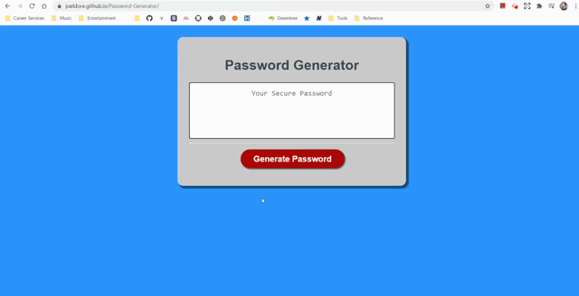

# Password Generator

## App Preview

Currently deployed at [GitHub Pages](https://joeldore.github.io/Password-Generator/)

## Description

This application generates a random secure password based on user-selected criteria. This app runs in the browser, and features dynamically updated HTML and CSS powered by JavaScript with a clean and responsive UI.

User's input is validated to meet client-specified requirements:

    * Password length (8-128 characters)
    * Must select at least one character type (lowercase, uppercase, numeric, or special characters)

## Future Development

* Redesign CSS

* Select password text upon generation with option to copy (in a tooltip?)

## 📝 License
Copyright © 2020 [Joel Dore](https://github.com/JoelDore)  
This project is [MIT](https://github.com/JoelDore/Password-Generator/blob/main/LICENSE) licensed.

---
 

 
 

